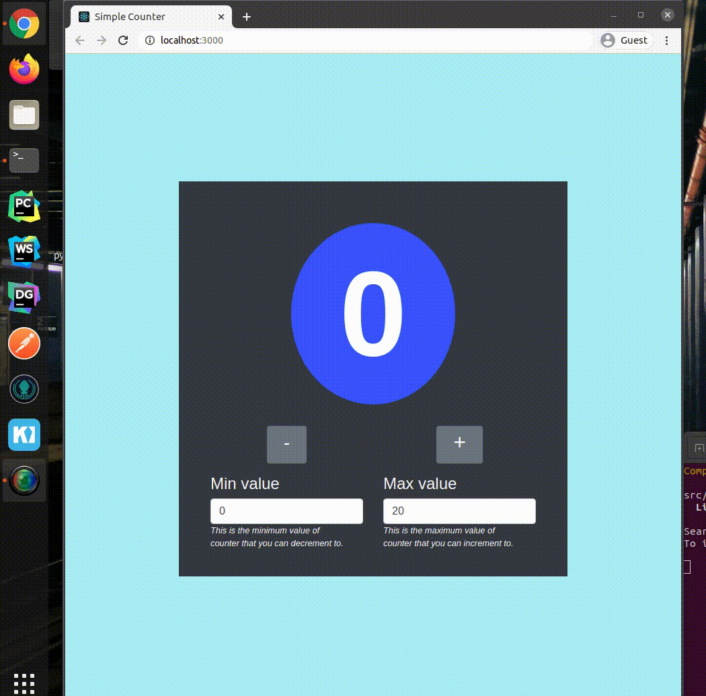

# A Simple Counter Application (React)

A Simple Counter Application that allows users to increase and decrease of counter.The user can input and lock the
minimum values, maximum values. After setting the locked value user can decrease or increase the values according to
their needs.Simply visit at the application and find out more about it. The simple screenshot explains many details
about the application.

Technical Specifications:
A React project where a simple counter application allows users to simply count the numbers in increasing or decreasing
manner with locked min and max values.

A responsive frontend designed using bootstrap.

Author:
Sundar Raj Gautam
